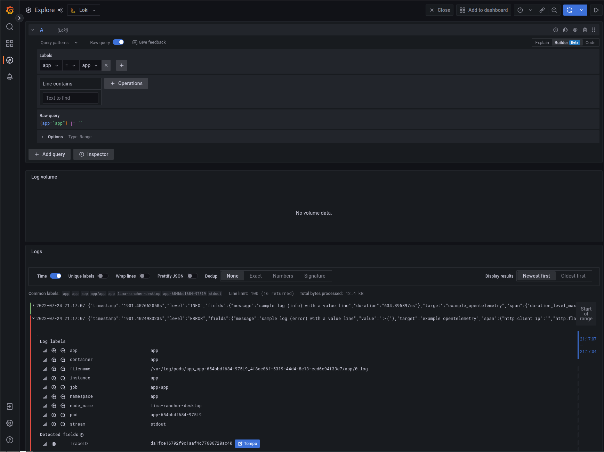
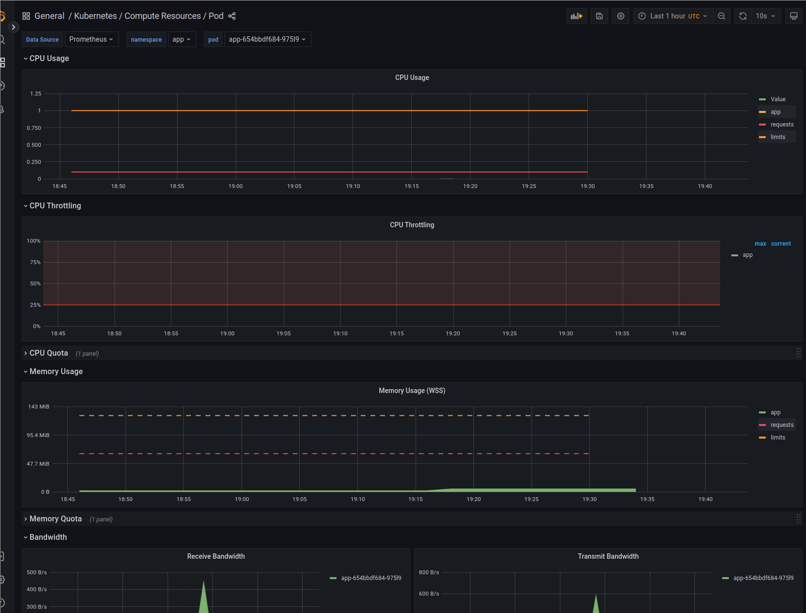

# sandbox_axum_observability <!-- omit in toc -->

!!! WIP !!!

Sandbox I used to experiment [axum] and observability (for target platform), observability via infra (as most as possible). The stack and framework selected:

- [App (Rust http service)](#app-rust-http-service)
  - [Main components for the app](#main-components-for-the-app)
  - [Usage on local shell](#usage-on-local-shell)
  - [direct to Jaeger](#direct-to-jaeger)
- [Infra](#infra)
  - [Light infra docker-compose](#light-infra-docker-compose)
  - [Kubernetes](#kubernetes)
    - [Main components for the infra](#main-components-for-the-infra)
    - [Infra setup](#infra-setup)
    - [Links & inspiration](#links--inspiration)

## App (Rust http service)

The setup of the app (microservice) defined under `/app`. The Goals of the app

- [ ] Use axum, async api,...
- [ ] Delegate collect of metrics, logs,... to the infra as much as possible (eg http status, rps, ...)
- [ ] Try to be a cloud native app, follow 12 factor app recommendation via:
  - [x] Configuration dependent of the platform / stack override via Environment variable (use clap)
  - [x] Health-check via a `GET /health` endpoint
  - [x] Log printed on std output, in json format
  - [x] Log include trace_id to easily link response, log and trace
    - [x] on first log of the span, when incoming request has trace_id
    - [x] on following log of the span, when incoming request has trace_id
    - [x] on first log of the span, when incoming request has NO trace_id (imply start an new one)
    - [x] on following log of the span, when incoming request has trace_id
- [x] To simulate a multi-level microservice architecture, the service can call `APP_REMOTE_URL` (to define as it-self in the infra)
- [ ] Provide a endpoint `GET /depth/{:depth}` that wait a `duration` then call endpoint defined by `APP_REMOTE_URL` with the path parameter `depth` equals to current `depth - 1`
  - [x] `depth`: value between 0 and 10, if undefined a random value will be used.
  - [x] `duration_level_max`: duration in seconds, if undefined a random between 0.0 and 2.0
  - [x] the response of `APP_REMOTE_URL` is returned as wrapped response
  - [x] if `depth` is 0, then it returns the `{ "trace_id": "...."}`
  - [ ] if failure, then it returns the `{ "err_trace_id": "...."}`
  - [x] call `GET /` is like calling `GET /depth/{:depth}` with a random depth between 0 and 10
- [ ] To simulate error
  - [ ] `GET /health` can failed randomly via configuration `APP_HEALTH_FAILURE_PROBABILITY` (value between `0.0` and `1.0`)
  - [ ] `GET /depth/{}` can failed randomly via query parameter `failure_probability` (value between `0.0` and `1.0`)
- [ ] add test to validate and to demo feature above

### Main components for the app

- [ ] [tokio-rs/axum: Ergonomic and modular web framework built with Tokio, Tower, and Hyper](https://github.com/tokio-rs/axum) as rust web framework.
- [ ] [tokio-rs/tracing: Application level tracing for Rust.](https://github.com/tokio-rs/tracing) (and also for log)
- [ ] [OpenTelemetry](https://opentelemetry.io/)

### Usage on local shell

Launch the server

```sh
cd app
cargo run
```

Send http request from a curl client

```sh
# without client trace
# FIXME the log on the server include an empty trace_id
❯ curl -i "http://localhost:8080/depth/0"
HTTP/1.1 200 OK
content-type: application/json
content-length: 67
access-control-allow-origin: *
vary: origin
vary: access-control-request-method
vary: access-control-request-headers
date: Sat, 21 May 2022 15:35:32 GMT

{"simulation":"DONE","trace_id":"522e44c536fec8020790c59f20560d1a"}⏎

# with client trace
# for traceparent see [Trace Context](https://www.w3.org/TR/trace-context/#trace-context-http-headers-format)
❯ curl -i "http://localhost:8080/depth/2" -H 'traceparent: 00-0af7651916cd43dd8448eb211c80319c-b9c7c989f97918e1-00'
HTTP/1.1 200 OK
content-type: application/json
content-length: 113
access-control-allow-origin: *
vary: origin
vary: access-control-request-method
vary: access-control-request-headers
date: Sat, 21 May 2022 15:33:54 GMT

{"depth":2,"response":{"depth":1,"response":{"simulation":"DONE","trace_id":"0af7651916cd43dd8448eb211c80319c"}}}⏎
```

on jaeger web ui,  service `example-opentelemetry` should be listed and trace should be like


### direct to Jaeger

Launch a local jaeger

```sh
## docker cli can be used instead of nerdctl
## to start jaeger (and auto remove on stop)
nerdctl run --name jaeger --rm -d -p6831:6831/udp -p6832:6832/udp -p16686:16686 jaegertracing/all-in-one:latest

# open web ui
open http://localhost:16686/


# send trace via jaeger protocol to local jaeger (agent)
cargo run -- --tracing-collector-kind jaeger

# to stop jaeger
nerdctl stop jaeger
```

## Infra

### Light infra docker-compose

based on [tempo/example/docker-compose/otel-collector at main · grafana/tempo](https://github.com/grafana/tempo/tree/main/example/docker-compose/otel-collector)

The otel-collector is configured to allow to received oltp, jaeger, zipkin trace and to expose port on localhost

```sh
cd infra/docker-compose

# or docker-compose
nerdctl compose up
```

Launch the server

```sh
# `oltp` is the default collector kind, but should also work with `jaeger`
cargo run
```

Send some curl command

Open your browser to grafana explorer [http://localhost:3000/explore](http://localhost:3000/explore), select `Tempo` datasource (pre-configured),  copy/paste the trace_id from log into search field, click "Run Query"


### Kubernetes

The setup of the infrastructure (cluster) defined under `/infra/kubernetes`.

- Try to be more like a target / live environment, so it requires more resources on local than using "local dev approach":
  - use distributed solution (loki, tempo,...)
  - use S3 backend (minio).
- no ingress or api gateway setup, access will be via port forward
- use wrapper/adapter helm chart to install components, like if it is deployed by a gitops (pull mode) system
- keep components separated to allow partial reuse and to identify integration point

#### Main components for the infra

- [ ] S3 buckets to store logs, metrics, traces,...
  - [ ] Use Minio to provide S3 buckets in on desktop cluster (use a deprecated version but easier to setup than the operator)
- [x] [Grafana](https://grafana.com/oss/grafana/) for dashboard and integration of log, trace, metrics
  - artifacthub.io : [grafana 6.31.0 · grafana/grafana](https://artifacthub.io/packages/helm/grafana/grafana)
  - enable sidecars, to allow other components to register datasources, dashboards, notifiers, alerts
- [x] [Grafana Tempo](https://grafana.com/oss/tempo/) to store trace
  - artifacthub.io: [tempo-distributed 0.20.2 · grafana/grafana](https://artifacthub.io/packages/helm/grafana/tempo-distributed)
  - Setup of tempo is based on [tempo/example/helm at main · grafana/tempo](https://github.com/grafana/tempo/tree/main/example/helm), in distributed mode (consume more resources, aka several pods)
- [x] [Grafana Loki](https://grafana.com/oss/loki/) to store log
- [x] [Promtail](https://grafana.com/docs/loki/latest/clients/promtail/) as log collector (also provide by Grafana)
  - artifacthub.io: [promtail 6.0.0 · grafana/grafana](https://artifacthub.io/packages/helm/grafana/promtail)
- [x] [prometheus-operator/kube-prometheus: Use Prometheus to monitor Kubernetes and applications running on Kubernetes](https://github.com/prometheus-operator/kube-prometheus), a collection of Kubernetes manifests, Grafana dashboards, and Prometheus rules combined with documentation and scripts to provide easy to operate end-to-end Kubernetes cluster monitoring with Prometheus using the Prometheus Operator.
  - artifacthub.io :[kube-prometheus-stack 36.2.0 · prometheus/prometheus-community](https://artifacthub.io/packages/helm/prometheus-community/kube-prometheus-stack))
  - provide(by default, see doc): grafana, prometheus-operator, prometheus, alertnamaner, node-exporter
- [x] [Linkerd](https://linkerd.io/) a service-mesh but used for its observability feature
- [x] [OpenTelemetry Collector](https://opentelemetry.io/docs/collector/) as collector for traces
  - artifacthub.io: [opentelemetry-collector 0.22.0 · opentelemetry/opentelemetry-helm](https://artifacthub.io/packages/helm/opentelemetry-helm/opentelemetry-collector)
  - alternatives: grafana agent, send directly to tempo, use the collector from linkerd-jaeger
  - [ ] TODO: use opentelemetry operator (currently some issue with port)
- [x] [Rancher Desktop](https://rancherdesktop.io/) as kubernetes cluster for local test, but I hope the code to be easily portable for kind, minikube, k3d, k3s,...
- [ ] Additional dashboards, alerts,... installed via grafana's sidecars
- [ ] Use secrets for credentials

#### Infra setup

Required:

- `kubectl`, `helm` v3 : to manage the k8s cluster

Optional:

- `nushell`: to use `tools.nu` and to avoid too many manual commands
- Lens / OpenLens / k9s / your favorite UI: to explore states of k8s cluster

```nushell
# launch nushell
nu
# after launch of your local (or remote) cluster, configure kubectl to access it as current context
cd infra/kubernetes
use tools.nu
tools install_all_charts
# to uninstall stuff ;-)
tools uninstall_all_charts
# to have the list of subcommand
tools <tab>
```

- manual creation of `loki` bucket

sample list of components

```sh
❯ kubectl get service -A
NAMESPACE                 NAME                                             TYPE           CLUSTER-IP      EXTERNAL-IP    PORT(S)                                                   AGE
default                   kubernetes                                       ClusterIP      10.43.0.1       <none>         443/TCP                                                   95m
kube-system               kube-dns                                         ClusterIP      10.43.0.10      <none>         53/UDP,53/TCP,9153/TCP                                    95m
kube-system               metrics-server                                   ClusterIP      10.43.155.46    <none>         443/TCP                                                   95m
kube-system               traefik                                          LoadBalancer   10.43.205.20    192.168.5.15   80:30073/TCP,443:31505/TCP                                95m
cert-manager              cert-manager-webhook                             ClusterIP      10.43.208.146   <none>         443/TCP                                                   94m
cert-manager              cert-manager                                     ClusterIP      10.43.60.191    <none>         9402/TCP                                                  94m
minio                     minio                                            ClusterIP      10.43.19.151    <none>         9000/TCP                                                  94m
grafana                   grafana                                          ClusterIP      10.43.171.106   <none>         80/TCP                                                    93m
kube-system               kube-prometheus-stack-kube-scheduler             ClusterIP      None            <none>         10251/TCP                                                 93m
kube-system               kube-prometheus-stack-coredns                    ClusterIP      None            <none>         9153/TCP                                                  93m
kube-system               kube-prometheus-stack-kube-proxy                 ClusterIP      None            <none>         10249/TCP                                                 93m
kube-system               kube-prometheus-stack-kube-controller-manager    ClusterIP      None            <none>         10257/TCP                                                 93m
kube-system               kube-prometheus-stack-kube-etcd                  ClusterIP      None            <none>         2379/TCP                                                  93m
kube-prometheus-stack     kube-prometheus-stack-alertmanager               ClusterIP      10.43.114.25    <none>         9093/TCP                                                  93m
kube-prometheus-stack     kube-prometheus-stack-operator                   ClusterIP      10.43.244.229   <none>         443/TCP                                                   93m
kube-prometheus-stack     kube-prometheus-stack-prometheus-node-exporter   ClusterIP      10.43.173.60    <none>         9100/TCP                                                  93m
kube-prometheus-stack     kube-prometheus-stack-kube-state-metrics         ClusterIP      10.43.147.90    <none>         8080/TCP                                                  93m
kube-prometheus-stack     kube-prometheus-stack-prometheus                 ClusterIP      10.43.139.178   <none>         9090/TCP                                                  93m
kube-system               kube-prometheus-stack-kubelet                    ClusterIP      None            <none>         10250/TCP,10255/TCP,4194/TCP                              93m
loki-distributed          loki-distributed-memberlist                      ClusterIP      None            <none>         7946/TCP                                                  93m
loki-distributed          loki-distributed-ingester-headless               ClusterIP      None            <none>         3100/TCP,9095/TCP                                         93m
loki-distributed          loki-distributed-query-frontend                  ClusterIP      None            <none>         3100/TCP,9095/TCP,9096/TCP                                93m
loki-distributed          loki-distributed-querier-headless                ClusterIP      None            <none>         3100/TCP,9095/TCP                                         93m
loki-distributed          loki-distributed-distributor                     ClusterIP      10.43.235.183   <none>         3100/TCP,9095/TCP                                         93m
loki-distributed          loki-distributed-querier                         ClusterIP      10.43.35.214    <none>         3100/TCP,9095/TCP                                         93m
loki-distributed          loki-distributed-gateway                         ClusterIP      10.43.245.76    <none>         80/TCP                                                    93m
loki-distributed          loki-distributed-ingester                        ClusterIP      10.43.168.198   <none>         3100/TCP,9095/TCP                                         93m
tempo-distributed         tempo-distributed-gossip-ring                    ClusterIP      None            <none>         7946/TCP                                                  93m
tempo-distributed         tempo-distributed-query-frontend-discovery       ClusterIP      None            <none>         3100/TCP,9095/TCP,16686/TCP,16687/TCP                     93m
tempo-distributed         tempo-distributed-query-frontend                 ClusterIP      10.43.85.84     <none>         3100/TCP,9095/TCP,16686/TCP,16687/TCP                     93m
tempo-distributed         tempo-distributed-ingester                       ClusterIP      10.43.242.5     <none>         3100/TCP,9095/TCP                                         93m
tempo-distributed         tempo-distributed-querier                        ClusterIP      10.43.20.61     <none>         3100/TCP,9095/TCP                                         93m
tempo-distributed         tempo-distributed-distributor                    ClusterIP      10.43.13.183    <none>         3100/TCP,9095/TCP,4317/TCP,55680/TCP                      93m
tempo-distributed         tempo-distributed-memcached                      ClusterIP      10.43.106.141   <none>         11211/TCP,9150/TCP                                        93m
tempo-distributed         tempo-distributed-compactor                      ClusterIP      10.43.10.39     <none>         3100/TCP                                                  93m
tempo-distributed         tempo-distributed-metrics-generator              ClusterIP      10.43.129.131   <none>         9095/TCP,3100/TCP                                         93m
opentelemetry-collector   opentelemetry-collector                          ClusterIP      10.43.15.153    <none>         6831/UDP,14250/TCP,14268/TCP,4317/TCP,4318/TCP,9411/TCP   93m
linkerd                   linkerd-dst                                      ClusterIP      10.43.126.243   <none>         8086/TCP                                                  92m
linkerd                   linkerd-dst-headless                             ClusterIP      None            <none>         8086/TCP                                                  92m
linkerd                   linkerd-sp-validator                             ClusterIP      10.43.41.57     <none>         443/TCP                                                   92m
linkerd                   linkerd-policy                                   ClusterIP      None            <none>         8090/TCP                                                  92m
linkerd                   linkerd-policy-validator                         ClusterIP      10.43.225.36    <none>         443/TCP                                                   92m
linkerd                   linkerd-identity                                 ClusterIP      10.43.136.50    <none>         8080/TCP                                                  92m
linkerd                   linkerd-identity-headless                        ClusterIP      None            <none>         8080/TCP                                                  92m
linkerd                   linkerd-proxy-injector                           ClusterIP      10.43.51.211    <none>         443/TCP                                                   92m
app                       app                                              ClusterIP      10.43.108.47    <none>         80/TCP                                                    91m
linkerd-viz               metrics-api                                      ClusterIP      10.43.179.165   <none>         8085/TCP                                                  67m
linkerd-viz               tap-injector                                     ClusterIP      10.43.71.201    <none>         443/TCP                                                   67m
linkerd-viz               tap                                              ClusterIP      10.43.191.138   <none>         8088/TCP,443/TCP                                          67m
linkerd-viz               web                                              ClusterIP      10.43.18.39     <none>         8084/TCP,9994/TCP                                         67m
linkerd-jaeger            jaeger-injector                                  ClusterIP      10.43.72.101    <none>         443/TCP                                                   67m
```

Use port forward to access UI and service

```sh
# access grafana UI on http://127.0.0.1:8040
kubectl port-forward -n grafana service/grafana 8040:80

# access grafana UI on http://127.0.0.1:9009 (user/pass: minio/minio123)
kubectl port-forward -n minio service/minio 9009:9000

# access linerd-viz UI on http://127.0.0.1:8084
kubectl port-forward -n linkerd-viz service/web 8084:8084

# On rancher-desktop only
# access traefik dashboard on http://127.0.0.1:9000/dashboard/#/
bash -c 'kubectl port-forward -n kube-system $(kubectl -n kube-system get pods --selector "app.kubernetes.io/name=traefik" --output=name) 9000:9000'

```
<!--
# access grafana UI on https://127.0.0.1:9443
kubectl port-forward -n minio-tenant-1 service/tenant-1-console 9443:9443

# access minio Console of operator
# - install kubectl krew (see [Installing · Krew](https://krew.sigs.k8s.io/docs/user-guide/setup/install/))
kubectl krew install minio
kubectl minio proxy -n minio-operator
# console of tenant-1
kubectl minio proxy -n minio-tenant-1
-->

Setup the app and call it

```sh
kubectl port-forward -n app service/app 8080:80
curl -i "http://localhost:8080/depth/2"
```




But when using port-forward request doesn't go through linkerd proxy (so no monitoring of route,...) (see [port-forward traffic skips the proxy · Issue #2352 · linkerd/linkerd2](https://github.com/linkerd/linkerd2/issues/2352))
So If you don't have ingress setup,... you send request from inside the cluster:

```sh
kubectl run tmp-shell -n default --restart=Never --rm -i -tty --image curlimages/curl:7.84.0 -- curl -L -v http://app.app.svc.cluster.local/depth/3


# Or via an interactive shell if you want
kubectl run tmp-shell -n default --restart=Never --rm -i --tty --image curlimages/curl:7.84.0 -- sh
> curl -L -v http://app.app.svc.cluster.local/depth/3
...
> exit

kubectl delete pod tmp-shell -n default
```




Sample list of other dashboards


#### Links & inspiration

- [tempo/integration/microservices at main · grafana/tempo](https://github.com/grafana/tempo/tree/main/integration/microservices)
